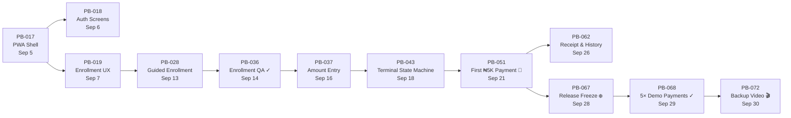

# Mubarak's Software Development Plan — PayByPalm Finals

**Owner:** Raji Mubarak (Software Dev)
**Partner:** Olusanya Ayodeji (Hardware + Backend)
**Period:** September 1–30, 2026

---

## Your Scope at a Glance

| Category | Tasks | Critical | High | Medium |
|:---------|:-----:|:--------:|:----:|:------:|
| **User PWA** (wallet app) | 8 | 3 | 5 | — |
| **Merchant Portal** | 5 | 1 | 3 | 1 |
| **Terminal UI** | 3 | 2 | 1 | — |
| **Subtotal: Core ownership** | **16** | **6** | **9** | **1** |
| Shared (Product Lead / QA) | ~10 | 7 | 3 | — |
| **Grand total** | **~26** | **13** | **12** | **1** |

---

## Week 1 — Foundation & PWA Shell (Sep 1–7)

> Phase 1 Foundation + Phase 2 Recognition & UX

### Shared — Do Together With Ayodeji
| ID | Task | Priority | Due | Notes |
|:---|:-----|:---------|:----|:------|
| PB-001 | Freeze one-month MVP and demo journey | Critical | Sep 1 | ⚠️ OVERDUE — lock this down first |
| PB-004 | Create Paystack test account, keys and webhook config | Critical | Sep 2 | Both of you need to understand the Paystack setup |
| PB-009 | Create repositories, environments and issue workflow | High | Sep 2 | You likely drive this as the software lead |

### Your Tasks
| ID | Task | Priority | Due | Depends on | What it means |
|:---|:-----|:---------|:----|:-----------|:--------------|
| PB-017 | Build installable PWA shell, routing and responsive navigation | High | Sep 5 | PB-009 | New PWA foundation — installable, mobile-first shell with routes for wallet, scan, merchant |
| PB-018 | Build sign-up, sign-in and profile screens | High | Sep 6 | PB-017 | Auth screens within the new PWA shell |
| PB-019 | Design consent and palm-enrollment flow | Critical | Sep 7 | PB-006, PB-017 | UX flow for consent → camera capture → palm linked confirmation. **Blocked by PB-006** (Ayodeji's consent/compliance task) |
| PB-020 | Create merchant dashboard wireframes | High | Sep 6 | PB-001 | Design only — layout for merchant portal before building it |

### Terminal UI (you may co-own)
| ID | Task | Priority | Due | Depends on | What it means |
|:---|:-----|:---------|:----|:-----------|:--------------|
| PB-012 | Build terminal palm preview with centred hand guide | High | Sep 5 | PB-011 | **Blocked by Ayodeji** connecting Camera Module 3 Wide. Overlay guide on the camera feed |

### Week 1 Dependency Chain
```
PB-001 (scope freeze) ──→ PB-020 (merchant wireframes)
PB-009 (repo/env setup) ──→ PB-017 (PWA shell)  ──→ PB-018 (auth screens)
                                                   ──→ PB-019 (enrollment UX) ← PB-006 (consent policy, Ayodeji)
PB-011 (camera hardware, Ayodeji) ──→ PB-012 (palm preview UI)
```

> [!IMPORTANT]
> **Week 1 is about your PWA foundation.** You're building the new app shell while Ayodeji sets up hardware and backend schema. PB-017 unlocks everything else you build — get it right.

---

## Week 2 — Enrollment & Binding (Sep 8–14)

> Phase 3 Enrollment & Binding

### Your Tasks
| ID | Task | Priority | Due | Depends on | What it means |
|:---|:-----|:---------|:----|:-----------|:--------------|
| PB-026 | Show masked saved card and remove-card action | High | Sep 12 | PB-024 (Ayodeji) | Display `Visa •••• 4321` in the wallet; let user remove it. **Blocked by Ayodeji** building card auth storage |
| PB-028 | Complete guided palm enrollment in PWA/terminal | Critical | Sep 13 | PB-019, PB-027 (Ayodeji) | The **full enrollment journey**: consent → QR scan → camera capture → palm linked. Connects your UX (PB-019) to Ayodeji's palm-user-card linking (PB-027) |
| PB-034 | Build merchant overview and terminal list | High | Sep 14 | PB-020, PB-031 (Ayodeji) | Turn wireframes into a working merchant dashboard showing assigned terminals and their status |

### Terminal UI
| ID | Task | Priority | Due | Depends on | What it means |
|:---|:-----|:---------|:----|:-----------|:--------------|
| PB-032 | Implement terminal config sync and version check | Critical | Sep 13 | PB-031 (Ayodeji) | Terminal fetches its config on boot, refuses checkout if disabled/stale/unassigned |

### Shared — QA Gate
| ID | Task | Priority | Due | What it means |
|:---|:-----|:---------|:----|:--------------|
| PB-036 | Run complete enrollment journey on mobile and terminal | Critical | Sep 14 | **Phase 3 exit gate.** A fresh user must complete account → consent → card → palm without anyone touching the database. If this fails, Phase 4 is building on sand |

### Week 2 Dependency Chain
```
PB-024 (card auth, Ayodeji) ──→ PB-026 (saved card UI)
PB-019 (your enrollment UX) ─┐
PB-027 (palm linking, Ayodeji) ──→ PB-028 (guided enrollment)
PB-020 (your wireframes) ─┐
PB-031 (terminal assign, Ayodeji) ──→ PB-034 (merchant overview)
                                   ──→ PB-032 (terminal config sync)

ALL OF ABOVE ──→ PB-036 (enrollment QA gate ✓)
```

> [!WARNING]
> **Week 2 is your heaviest dependency week.** Three of your four tasks are blocked by Ayodeji's backend work (PB-024, PB-027, PB-031). Coordinate daily — if his card authorization (PB-024) slips, your saved-card UI (PB-026) and enrollment flow (PB-028) both stall.

---

## Week 3 — Payment & Merchant Portal (Sep 15–21)

> Phase 4 Payment & Hardware

### Your Tasks
| ID | Task | Priority | Due | Depends on | What it means |
|:---|:-----|:---------|:----|:-----------|:--------------|
| PB-037 | Build amount-entry and payment-confirmation screens | Critical | Sep 16 | PB-032 | Terminal UI: merchant keys in the sale amount, customer sees it and taps Confirm |
| PB-044 | Build transaction list and transaction-detail view | High | Sep 18 | PB-034, PB-041 (Ayodeji) | Merchant portal: list of transactions with status, amount, timestamp. Tap for detail |
| PB-045 | Build expected T+1 settlement page | Critical | Sep 19 | PB-044 | Merchant portal: show pending → expected → settled states for the day's sales |

### Terminal UI
| ID | Task | Priority | Due | Depends on | What it means |
|:---|:-----|:---------|:----|:-----------|:--------------|
| PB-043 | Implement terminal state machine and safe timeout/retry UX | Critical | Sep 18 | PB-037, PB-038, PB-039 (Ayodeji) | The **full terminal payment flow**: idle → amount → capture → confirm → [step-up] → result. Handles timeouts, retries, errors gracefully |

### Shared — THE Milestone
| ID | Task | Priority | Due | What it means |
|:---|:-----|:---------|:----|:--------------|
| PB-051 | Complete first end-to-end ₦5,000 sandbox palm payment | Critical | Sep 21 | 🎯 **This is the moment.** A real card gets charged via palm scan through the full stack. Everything before this builds toward it; everything after hardens it |

### Week 3 Dependency Chain
```
PB-032 (your config sync) ──→ PB-037 (amount entry) ─┐
PB-038 (1:N endpoint, Ayodeji) ──────────────────────┤──→ PB-043 (terminal state machine)
PB-039 (charge API, Ayodeji) ─────────────────────────┘

PB-034 (your merchant overview) ─┐
PB-041 (webhook, Ayodeji) ───────┤──→ PB-044 (transaction list) ──→ PB-045 (settlement page)
                                 ┘

ALL ──→ PB-051 (first ₦5,000 payment 🎯)
```

> [!IMPORTANT]
> **Week 3 is demo week in miniature.** By Sep 21 you need the complete flow working end-to-end. PB-043 (terminal state machine) is your most complex single task — it's the entire payment UX from the merchant's side.

---

## Week 4 — Hardening, Polish & Demo (Sep 22–30)

> Phase 5 Settlement & Hardening + Phase 6 Freeze & Demo

### Your Tasks
| ID | Task | Priority | Due | Depends on | What it means |
|:---|:-----|:---------|:----|:-----------|:--------------|
| PB-056 | Implement consent withdrawal, palm unlink and account deletion request | High | Sep 25 | PB-028, PB-055 (Ayodeji) | Privacy flow: user can revoke consent, unlink palm, request account deletion from the wallet |
| PB-062 | Add payment receipt and transaction history | High | Sep 26 | PB-051 | Wallet app: show each payment with details, palm icon, merchant name |
| PB-061 | Add CSV export, settlement variance and terminal health indicators | Medium | Sep 26 | PB-045, PB-047 (Ayodeji) | Merchant portal polish — **lowest priority, skip if needed** |

### Shared — QA & Demo Prep
| ID | Task | Priority | Due | What it means |
|:---|:-----|:---------|:----|:--------------|
| PB-057 | Test decline, expired card, insufficient funds | Critical | Sep 25 | You test edge cases against Ayodeji's backend |
| PB-066 | Run MVP acceptance review | Critical | Sep 27 | Together: what passes, what's deferred |
| PB-067 | Freeze release candidate | Critical | Sep 28 | **No new features after this** |
| PB-068 | Run 5 consecutive e2e demo payments | Critical | Sep 29 | The real proof — 5 clean runs, no hacks |
| PB-072 | Record backup video and dress rehearsal | Critical | Sep 30 | If live network fails at finals, this saves you |
| PB-073 | Sign off and post-month roadmap | Critical | Sep 30 | What was proven, what's next |

> [!CAUTION]
> **PB-061 (CSV export) is your only Medium-priority task. Cut it first if anything slips.** The judges will never ask a merchant to export a CSV during a 10-minute demo.

---

## Your Critical Path (the tasks that gate the demo)



**If any task on this chain slips, the demo is at risk.**

---

## What You Already Have vs. What's New

Mapping your plan against [the existing codebase](file:///c:/Users/XPS/Pay-By-Palm/wallet/src):

| Your Task | Existing Code | Effort Level |
|:----------|:-------------|:-------------|
| PB-017 PWA shell | [App.tsx](file:///c:/Users/XPS/Pay-By-Palm/wallet/src/App.tsx), [main.tsx](file:///c:/Users/XPS/Pay-By-Palm/wallet/src/main.tsx) — routing + auth guards exist | **Extend** — add PWA manifest, service worker |
| PB-018 Auth screens | [Auth.tsx](file:///c:/Users/XPS/Pay-By-Palm/wallet/src/routes/Auth.tsx) — sign-in/sign-up exist | **Extend** — add profile screen |
| PB-019 Enrollment UX | [Scan.tsx](file:///c:/Users/XPS/Pay-By-Palm/wallet/src/routes/Scan.tsx) — QR scan + waiting exist | **Redesign** — add consent step, card linking |
| PB-026 Saved card UI | Nothing exists | **New build** |
| PB-028 Guided enrollment | [Scan.tsx](file:///c:/Users/XPS/Pay-By-Palm/wallet/src/routes/Scan.tsx) — partial | **Major rework** — add card + consent steps |
| PB-037 Amount entry | [Amount.tsx](file:///c:/Users/XPS/Pay-By-Palm/wallet/src/terminal/screens/Amount.tsx) exists | **Extend** — adapt for Paystack flow |
| PB-043 Terminal state machine | [TerminalApp.tsx](file:///c:/Users/XPS/Pay-By-Palm/wallet/src/terminal/TerminalApp.tsx) — full state machine exists | **Extend** — add card-payment states, timeout hardening |
| PB-044/045 Merchant portal | Nothing exists | **New build** |
| PB-056 Consent withdrawal | Palm unlink exists in profile sheet | **Extend** — add consent + deletion |
| PB-062 Receipt & history | [Dashboard.tsx](file:///c:/Users/XPS/Pay-By-Palm/wallet/src/routes/Dashboard.tsx) — history exists | **Extend** — add receipt detail view |

> [!TIP]
> **8 of your 16 tasks extend existing code rather than building from scratch.** This is your biggest advantage — lean on what's already working.

---

## Summary for Sharing With Olusanya Ayodeji

**Your 16 core tasks, by week:**

| Week | You (Mubarak Raji) Build | Blocked By Olusanya Ayodeji | Key Milestone |
|:-----|:---------------------|:-------------------|:--------------|
| **Week 1** (Sep 1–7) | PWA shell, auth screens, enrollment UX design, merchant wireframes | PB-006 (consent policy), PB-011 (camera) | App shell running |
| **Week 2** (Sep 8–14) | Saved card UI, guided enrollment, merchant overview, terminal config sync | PB-024 (card auth), PB-027 (palm linking), PB-031 (terminal assign) | Enrollment QA passes |
| **Week 3** (Sep 15–21) | Amount entry, terminal state machine, merchant transactions + settlement page | PB-038 (1:N API), PB-039 (charge API), PB-041 (webhooks) | **First ₦5K payment** |
| **Week 4** (Sep 22–30) | Consent withdrawal, receipt/history, polish | PB-055 (image deletion) | Freeze → 5× demo → video |

**What you need from Olusanya Ayodeji on time, or you're stuck:**
1. **PB-024** (card auth storage) by Sep 11 — gates your card UI + enrollment
2. **PB-027** (palm-user-card link) by Sep 12 — gates guided enrollment
3. **PB-038 + PB-039** (1:N API + charge) by Sep 17 — gates terminal payment flow
4. **PB-041** (webhooks) by Sep 18 — gates merchant transaction list
